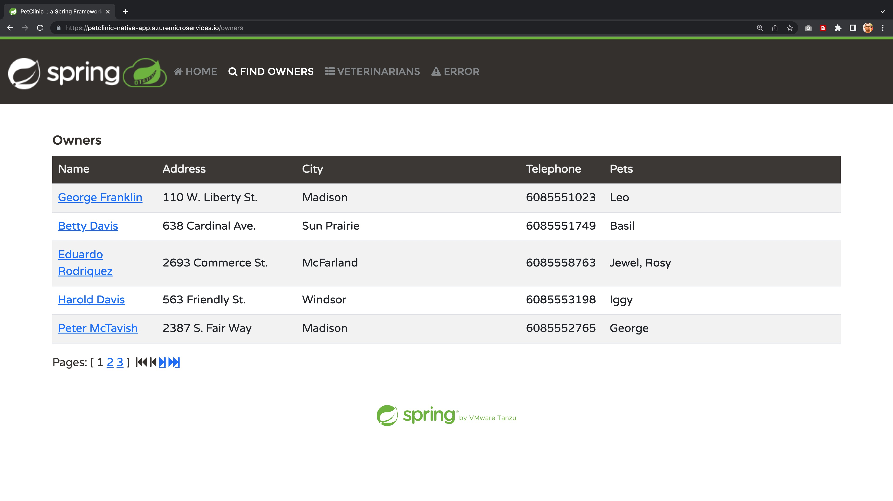
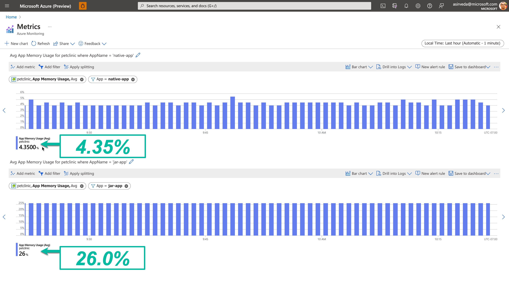

# Deploy Spring Native Apps to Azure

Azure Spring Apps enables you to easily run Spring Native applications on Azure.

This quickstart shows you how to deploy existing applications written in Java to Azure as Java Native Image applications. When you're finished, you can continue to manage the application via the Azure CLI or switch to using the Azure Portal.

## What will you experience

You will:

* Provision an Azure Spring Apps service instance.
* Deploy Spring Native applications to Azure and build using Tanzu Build Service
* Open the application
* Monitor applications

## Understanding the Spring Petclinic application with a few diagrams
<a href="https://speakerdeck.com/michaelisvy/spring-petclinic-sample-application">See the presentation here</a>

<!-- 
## Running petclinic locally
Petclinic is a [Spring Boot](https://spring.io/guides/gs/spring-boot) application built using [Maven](https://spring.io/guides/gs/maven/) or [Gradle](https://spring.io/guides/gs/gradle/). You can build a jar file and run it from the command line (it should work just as well with Java 17 or newer):


```
mkdir source-code
cd source-code
git clone https://github.com/selvasingh/spring-petclinic.git
cd spring-petclinic
./mvnw package
java -jar target/*.jar
```

You can then access petclinic at http://localhost:8080/


Or you can run it from Maven directly using the Spring Boot Maven plugin. If you do this, it will pick up changes that you make in the project immediately (changes to Java source files require a compile as well - most people use an IDE for this):

```
./mvnw spring-boot:run
```

> NOTE: If you prefer to use Gradle, you can build the app using `./gradlew build` and look for the jar file in `build/libs`.

-->

## What you will need

In order to deploy a Java app to cloud, you need
an Azure subscription. If you do not already have an Azure
subscription, you can activate your
[MSDN subscriber benefits](https://azure.microsoft.com/pricing/member-offers/msdn-benefits-details/)
or sign up for a
[free Azure account]((https://azure.microsoft.com/free/)).

In addition, you will need the following:

| [Azure CLI version 2.47.0 or higher](https://docs.microsoft.com/cli/azure/install-azure-cli?view=azure-cli-latest)
| [Git](https://git-scm.com/)
| [`jq` utility](https://stedolan.github.io/jq/download/)
|

Note -  On Windows, the [`jq` utility](https://stedolan.github.io/jq/download/) should be renamed from `jq-win64.exe` to `jq.exe` and added to the `PATH`

Note - The Bash shell. While Azure CLI should behave identically on all environments, shell
semantics vary. Therefore, only bash can be used with the commands in this repo.
To complete these repo steps on Windows, use Git Bash that accompanies the Windows distribution of
Git. Use only Git Bash to complete this training on Windows. Do not use WSL.

### OR Use Azure Cloud Shell

Or, you can use the Azure Cloud Shell. Azure hosts Azure Cloud Shell, an interactive shell
environment that you can use through your browser. You can use the Bash with Cloud Shell
to work with Azure services. You can use the Cloud Shell pre-installed commands to run the
code in this README without having to install anything on your local environment. To start Azure
Cloud Shell: go to [https://shell.azure.com](https://shell.azure.com), or select the
Launch Cloud Shell button to open Cloud Shell in your browser.

To run the code in this article in Azure Cloud Shell:

1. Start Cloud Shell.

2. Select the Copy button on a code block to copy the code.

3. Paste the code into the Cloud Shell session by selecting Ctrl+Shift+V on Windows and Linux or by selecting Cmd+Shift+V on macOS.

4. Select Enter to run the code.

## Install the Azure CLI extension

Install the Azure Spring Apps extension for the Azure CLI using the following command

```shell
az extension add --name spring
```

If the extension is already installed, update it with the following command

```shell
az extension update --name spring
```

Note - In some cases, the update command may fail and it will be necessary to reinstall the Azure
Spring Apps extension. Use the following command to remove previous versions and install the latest 
Azure Spring Apps extension:

```shell
az extension remove --name spring-cloud
az extension remove --name spring
az extension add --name spring
```

## Clone the repo

### Create a new folder and clone the sample app repository to your Azure Cloud account

If you have not already cloned this sample repo, please clone the repo:

```shell
mkdir source-code
cd source-code
git clone https://github.com/selvasingh/spring-petclinic
cd spring-petclinic
```

## Unit 1 - Create Azure Spring Apps and Applications

### Prepare your environment for deployments

Create a bash script with environment variables by making a copy of the supplied template:

```shell
cp ./azure/setup-env-variables-template.sh ./azure/setup-env-variables.sh
```

Open `./azure/setup-env-variables.sh` and enter the following information:

```shell
export SUBSCRIPTION=subscription-id # replace it with your subscription-id
export RESOURCE_GROUP=resource-group-name # existing resource group or one that will be created in next steps
export SPRING_APPS_SERVICE=azure-spring-apps-name # name of the service that will be created in the next steps
export LOG_ANALYTICS_WORKSPACE=log-analytics-name # existing workspace or one that will be created in next steps
export REGION=region-name # choose a region with Enterprise tier support

export MYSQL_SERVER_NAME=mysql-servername # customize this
export MYSQL_SERVER_ADMIN_NAME=admin-name # customize this
export MYSQL_SERVER_ADMIN_PASSWORD=SuperS3cr3t # customize this
```

The REGION value should be one of available regions for Azure Spring Apps (e.g. eastus). Please visit [here](https://azure.microsoft.com/en-us/global-infrastructure/services/?products=spring-apps&regions=all) for all available regions for Azure Spring Apps.

Then, set the environment:

```shell
source ./azure/setup-env-variables.sh
```

### Login to Azure

Login to the Azure CLI and choose your active subscription. 

```shell
az login
az account list -o table
az account set --subscription ${SUBSCRIPTION}
```

### Create Azure Spring Apps service instance

Prepare a name for your Azure Spring Apps service.  The name must be between 4 and 32 characters long and can contain only lowercase letters, numbers, and hyphens.  The first character of the service name must be a letter and the last character must be either a letter or a number.

Create a resource group to contain your Azure Spring Apps service.

> Note: This step can be skipped if using an existing resource group

```shell
az group create --name ${RESOURCE_GROUP} \
    --location ${REGION}
```

Accept the legal terms and privacy statements for the Enterprise tier.

> Note: This step is necessary only if your subscription has never been used to create an Enterprise tier instance of Azure Spring Apps.

```shell
az provider register --namespace Microsoft.SaaS
az term accept --publisher vmware-inc --product azure-spring-cloud-vmware-tanzu-2 --plan asa-ent-hr-mtr
```

Create an instance of Azure Spring Apps Enterprise.

```shell
az spring create --name ${SPRING_APPS_SERVICE} \
    --resource-group ${RESOURCE_GROUP} \
    --location ${REGION} \
    --sku Enterprise \
    --enable-alv \
    --build-pool-size S7 
```

> Note: If the `create` command fails, try updating the Azure Spring Apps extension described [here](#install-the-azure-cli-extension)

> Note: The service instance will take around 10-15 minutes to deploy.

Set your default resource group name and cluster name using the following commands:

```shell
az configure --defaults \
    group=${RESOURCE_GROUP} \
    location=${REGION} \
    spring=${SPRING_APPS_SERVICE}
```
### Configure Log Analytics for Azure Spring Apps

Create a Log Analytics Workspace to be used for your Azure Spring Apps service.

> Note: This step can be skipped if using an existing workspace

```shell
az monitor log-analytics workspace create \
  --workspace-name ${LOG_ANALYTICS_WORKSPACE} \
  --location ${REGION} \
  --resource-group ${RESOURCE_GROUP}   
```

Retrieve the resource ID for the recently create Azure Spring Apps Service and Log Analytics Workspace:

```shell
export LOG_ANALYTICS_RESOURCE_ID=$(az monitor log-analytics workspace show \
    --resource-group ${RESOURCE_GROUP} \
    --workspace-name ${LOG_ANALYTICS_WORKSPACE} | jq -r '.id')

export SPRING_APPS_RESOURCE_ID=$(az spring show \
    --name ${SPRING_APPS_SERVICE} \
    --resource-group ${RESOURCE_GROUP} | jq -r '.id')
```

Configure diagnostic settings for the Azure Spring Apps Service:

```shell
az monitor diagnostic-settings create --name "send-logs-and-metrics-to-log-analytics" \
    --resource ${SPRING_APPS_RESOURCE_ID} \
    --workspace ${LOG_ANALYTICS_RESOURCE_ID} \
    --logs '[
         {
           "category": "ApplicationConsole",
           "enabled": true,
           "retentionPolicy": {
             "enabled": false,
             "days": 0
           }
         },
         {
            "category": "SystemLogs",
            "enabled": true,
            "retentionPolicy": {
              "enabled": false,
              "days": 0
            }
          },
         {
            "category": "IngressLogs",
            "enabled": true,
            "retentionPolicy": {
              "enabled": false,
              "days": 0
             }
           }
       ]' \
       --metrics '[
         {
           "category": "AllMetrics",
           "enabled": true,
           "retentionPolicy": {
             "enabled": false,
             "days": 0
           }
         }
       ]'
```

> Note: For Git Bash users, this command may fail when resource IDs are misinterpreted as file paths because they begin with `/`. 
> 
> If the above command fails, try setting MSYS_NO_PATHCONV using:
> 
> `export MSYS_NO_PATHCONV=1`

### Configure Tanzu Build Service

Create a custom builder in Tanzu Build Service using the Azure CLI:

```shell
az spring build-service builder update -n ${DEFAULT_BUILDER} \
    --builder-file azure/builder-default.json \
    --no-wait

az spring build-service builder create -n ${NATIVE_BUILDER} \
    --builder-file azure/builder-native.json \
    --no-wait
```

### Create applications in Azure Spring Apps

Create an application for each service:

```shell
az spring app create --name ${JAR_APP} --cpu 2 --memory 4Gi --assign-endpoint &
az spring app create --name ${NATIVE_APP} --cpu 2 --memory 4Gi --assign-endpoint &
wait
```

## Unit 2 - Create MySQL Database

Create a MySQL database in Azure Database for MySQL.

```bash
# create mysql server and provide access from Azure resources
az mysql flexible-server create \
    --name ${MYSQL_SERVER_NAME} \
    --resource-group ${RESOURCE_GROUP} \
    --location ${REGION} \
    --admin-user ${MYSQL_SERVER_ADMIN_NAME}  \
    --admin-password ${MYSQL_SERVER_ADMIN_PASSWORD} \
    --public-access 0.0.0.0 \
    --tier Burstable \
    --sku-name Standard_B1ms \
    --storage-size 32

# allow access from your dev machine for testing
MY_IP=$(curl whatismyip.akamai.com)
az mysql flexible-server firewall-rule create \
        --resource-group ${RESOURCE_GROUP} \
        --name ${MYSQL_SERVER_NAME} \
        --rule-name devMachine \
        --start-ip-address ${MY_IP} \
        --end-ip-address ${MY_IP}

# create database
az mysql flexible-server db create \
        --resource-group ${RESOURCE_GROUP} \
        --server-name ${MYSQL_SERVER_NAME} \
        --database-name ${MYSQL_DATABASE_NAME}

# increase connection timeout
az mysql flexible-server parameter set \
    --resource-group ${RESOURCE_GROUP} \
    --server ${MYSQL_SERVER_NAME} \
    --name wait_timeout \
    --value 2147483

# set timezone   
az mysql flexible-server parameter set \
    --resource-group ${RESOURCE_GROUP} \
    --server ${MYSQL_SERVER_NAME} \
    --name time_zone \
    --value "US/Pacific"

# create managed identity for mysql. By assigning the identity to the mysql server, it will enable Azure AD authentication
az identity create \
    --name ${MYSQL_IDENTITY} \
    --resource-group ${RESOURCE_GROUP} \
    --location ${REGION}

IDENTITY_ID=$(az identity show --name ${MYSQL_IDENTITY} --resource-group ${RESOURCE_GROUP} --query id -o tsv)

# jar-app service connection
az spring connection create mysql-flexible \
    --resource-group ${RESOURCE_GROUP} \
    --service ${SPRING_APPS_SERVICE} \
    --connection MySQL_Petclinic \
    --app ${JAR_APP} \
    --deployment default \
    --tg ${RESOURCE_GROUP} \
    --server ${MYSQL_SERVER_NAME} \
    --database ${MYSQL_DATABASE_NAME} \
    --secret name=${MYSQL_SERVER_ADMIN_NAME} secret=${MYSQL_SERVER_ADMIN_PASSWORD} \
    --client-type springboot

# native-app service connection
az spring connection create mysql-flexible \
    --resource-group ${RESOURCE_GROUP} \
    --service ${SPRING_APPS_SERVICE} \
    --connection MySQL_Petclinic \
    --app ${NATIVE_APP} \
    --deployment default \
    --tg ${RESOURCE_GROUP} \
    --server ${MYSQL_SERVER_NAME} \
    --database ${MYSQL_DATABASE_NAME} \
    --secret name=${MYSQL_SERVER_ADMIN_NAME} secret=${MYSQL_SERVER_ADMIN_PASSWORD} \
    --client-type springboot 
```

## Unit 3 - Build and Deploy Spring Native Applications

### Deploy Spring Applications

Deploy and build the same application as JAR and Java Native Image, specifying its required parameters:

```shell
# Deploy Petclinic app built as JAR
az spring app deploy --name ${JAR_APP} \
    --source-path . \
    --build-env BP_JVM_VERSION=17

# Deploy Petclinic app built as Java Native Image
az spring app deploy --name ${NATIVE_APP} \
    --builder ${NATIVE_BUILDER} \
    --build-cpu 8 \
    --build-memory 16Gi \
    --source-path . \
    --build-env BP_JVM_VERSION=17 BP_NATIVE_IMAGE=true BP_MAVEN_BUILD_ARGUMENTS="-Dmaven.test.skip=true -Pnative package"
```

> Note: Deploying all applications will take 5-10 minutes

### Get the Log Stream for Applications

Use the following commands to get the latest 100 lines of app console logs from the deployed applications.

```shell
# Get log stream for the deployed JAR app
az spring app logs -n ${JAR_APP} --lines 100

# Get log stream for the deployed Java Native Image app
az spring app logs -n ${NATIVE_APP} --lines 100
```

By adding a `-f` parameter you can get real-time log streaming from the app. Try log streaming for the deployed applications.

```bash
# Get log stream for the deployed JAR app
az spring app logs -n ${JAR_APP} -f

# Get log stream for the deployed Java Native Image app
az spring app logs -n ${NATIVE_APP} -f
```

You can use `az spring app logs -h` to explore more parameters and log stream functionalities.

### Open Applications

```shell
az spring app show --name ${NATIVE_APP} --query properties.url --output tsv
az spring app show --name ${JAR_APP} --query properties.url --output tsv
```

Navigate to the URL provided by the previous commands to open the Pet Clinic application.



## Unit 4 - Observe Optimized Memory Usage

You can run some loads tests against the `jar-app` and `native-app` and compare the memory usage. We ran. The screenshot below shows optimized memory usage of this native image deployment – which is about 1/5th of the memory consumed by its equivalent JAR deployment - for a constant workload of 400 requests per second into the monolithic version of this Petclinic application.



## Next Steps

In this quickstart, you deployed an existing Spring application as a Java Native Image application on Azure. To learn more about Azure Spring Apps, go to:

- [Azure Spring Apps](https://azure.microsoft.com/products/spring-apps/)
- [Azure Spring Apps docs](https://learn.microsoft.com/en-us/azure/spring-apps/)

## Credits

This Spring microservices sample is forked from 
[spring-projects/spring-petclinic](https://github.com/spring-projects/spring-petclinic) - see [Petclinic README](./README-petclinic.md). 

## Contributing

This project welcomes contributions and suggestions.  Most contributions require you to agree to a
Contributor License Agreement (CLA) declaring that you have the right to, and actually do, grant us
the rights to use your contribution. For details, visit https://cla.opensource.microsoft.com.

When you submit a pull request, a CLA bot will automatically determine whether you need to provide
a CLA and decorate the PR appropriately (e.g., status check, comment). Simply follow the instructions
provided by the bot. You will only need to do this once across all repos using our CLA.

This project has adopted the [Microsoft Open Source Code of Conduct](https://opensource.microsoft.com/codeofconduct/).
For more information see the [Code of Conduct FAQ](https://opensource.microsoft.com/codeofconduct/faq/) or
contact [opencode@microsoft.com](mailto:opencode@microsoft.com) with any additional questions or comments.


