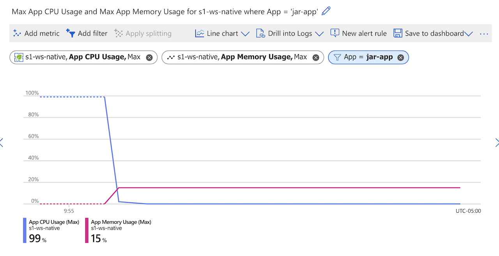
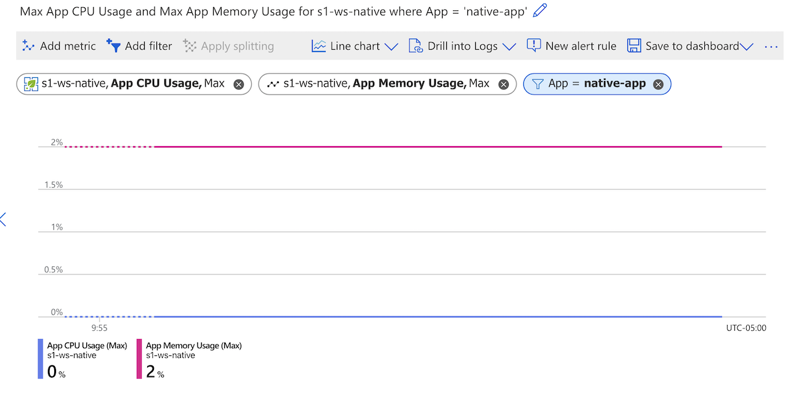
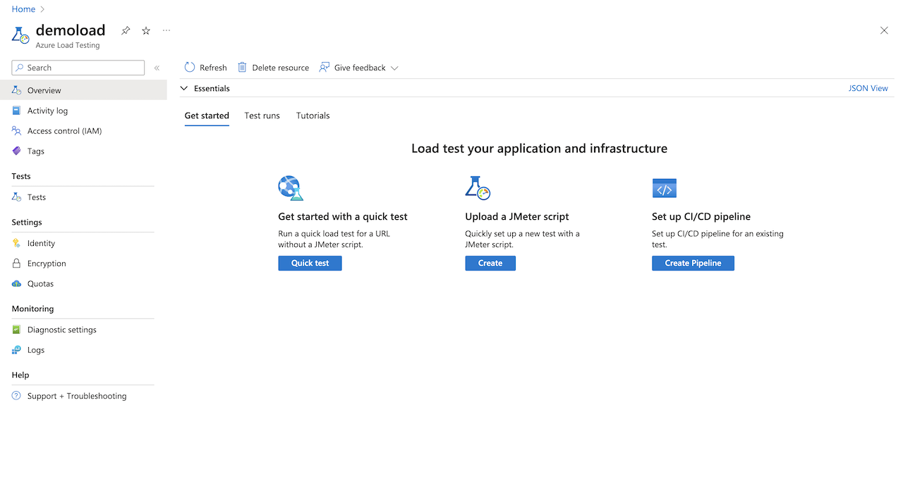
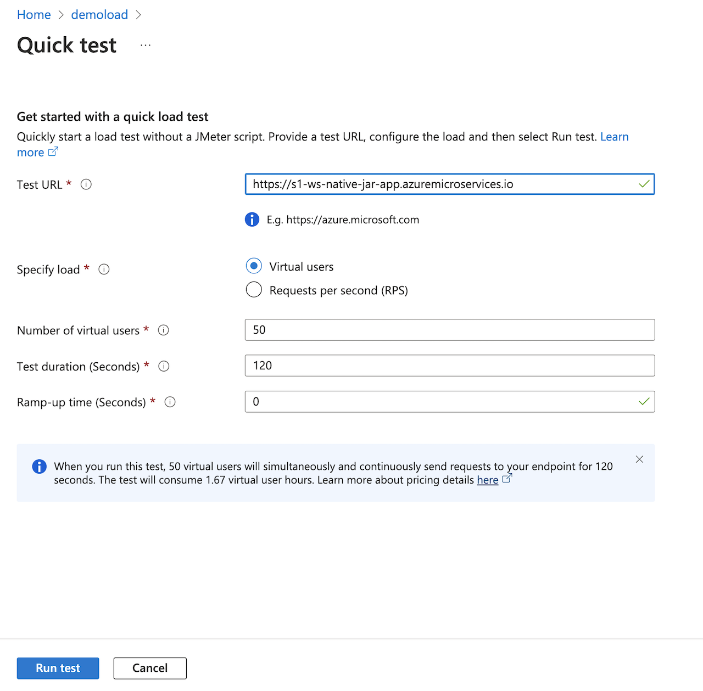
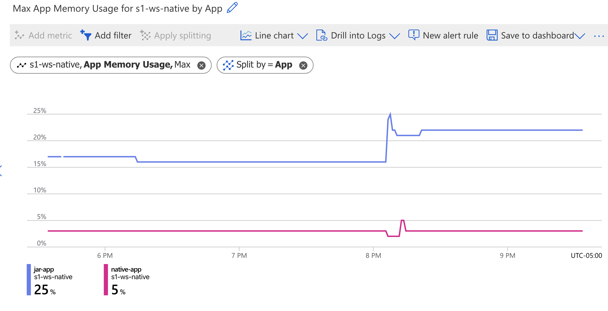

# Workshop Content

* [Deploy Spring Native Application to Azure Spring Apps Enterprise](../README.md)
  * [Unit 0 - Prerequisites and Setup](../step-00-setup-your-environment/README.md)
  * [Unit 1 - Create an Azure Spring Apps application](../step-01-create-asa-app/README.md)
  * [Unit 2 - Deploy an Azure Spring Apps application](../step-02-deploy-asa-app/README.md)
  * [Unit 3a - Bind to PostgreSQL Database](../step-03a-bind-to-postgresql-database/README.md)
  * [Unit 3b - Bind to MySQL Database](../step-03b-bind-to-mysql-database/README.md)
  * [Unit 4 - Measuring and Optimizing Usage](../step-04-measuring-and-optimizing-usage/README.md)
    * [Add metrics and view usage](../step-04-measuring-and-optimizing-usage/README.md#add-metrics-and-view-usage)
    * [Load test both applications](../step-04-measuring-and-optimizing-usage/README.md#load-test-both-applications)
    * [Add Load testing resource](../step-04-measuring-and-optimizing-usage/README.md#add-load-testing-resource)
    * [Run Tests](../step-04-measuring-and-optimizing-usage/README.md#run-tests)
    * [Scale and observe](../step-04-measuring-and-optimizing-usage/README.md#scale-and-observe)
    * [Application Live View Metrics](../step-04-measuring-and-optimizing-usage/README.md#application-live-view-metrics)
  * [Unit 5 - Run and Build App Locally](../step-05-run-and-build-app-locally/README.md)

# Unit 4 - Measuring and Optimizing Usage

In this module we will observe the application with App Live View. We will compare the two versions
of the application and observe the memory profile differences. We will play with various log levels.
We will stress test the application with load testing tools.

We are starting out with a more traditional Spring Boot sizing in the workshop of 2 cores and 4Gi
of memory. Since the metrics are in percentages of allocation, this allows us  to compare
"apples to apples" and see our usage.

## Add metrics and view usage

Navigate to Monitoring->Metrics on the left side in the Azure Portal. 

First, click Add Metric, select App CPU Usage from the dropdown, then add a second metric by clicking
Add Metric, and select App Memory Usage from the dropdown. From here, add a Filter with a Property
of App, which you can use to compare usage between the two applications.

Here, if you look at the applications on startup, you can see the very different CPU usage of the
JVM-based app compared to the Native app, and you can see a much smaller memory footprint for the
Native app as compared to the JVM app.

JVM:


Native: 


## Load test both applications 

For the Load test step you'll want to have on hand the endpoints to the two applications,
so retrieve the URLs using these two commands:

```shell
az spring app show --name ${JAR_APP} --query properties.url --output tsv
az spring app show --name ${NATIVE_APP} --query properties.url --output tsv
```

### Add Load testing resource

Add an Azure Load Testing resource from the Create Resource screen in the Azure Portal by searching
for Azure Load Testing and creating one with defaults in your resource group.



Open the resource we've just created, then click the `Get Started with Quick Test` button to start
a quick test.


### Run Tests

On the Quick Test screen, plug in the Jar App's url and keep the default settings, and select
`Run Test` and wait a few minutes it to complete. When complete, you can repeat the process with
the Native App, and then compare results in the portal on the Test Runs page.



Let's go to the metrics page on our ASA-E instance and see the results of our load testing. There
should be a large spike in CPU usage and a smaller spike in memory. Our Native app holds at a much
smaller memory footprint.  They will both take up all available CPU under a default settings load
test.

Native is still very light usage:


### Scale and observe

Now let's scale the Native app to a smaller allocation, half a core and 512Mi of memory.

```shell
az spring app scale --name ${NATIVE_APP} --cpu 500m --memory 512Mi
```

View the change here or in the user interface:

```shell
 az spring app show --name ${NATIVE_APP} \
  --query properties.activeDeployment.properties.deploymentSettings.resourceRequests
```

We can run a load test again on the native app to compare the performance with the larger scale. 

If we do need more throughput than the native app can give, we can set up an autoscaler, using the
Scale Out options, letting us save money on cores and scale up as needed.

### Application Live View Metrics

To look at startup times let's go to `Application Live View`.  Retrieve the Developer Tools url, e.g.

```shell
az spring dev-tool show --query properties.url --output tsv
```

Or from the ASA-E Portal choose Developer Tools from the left-hand menu, and find the url for
`Application Live View`.

Click on the `Live View` link, and choose `native-app`, then `Metrics`.   

Select `application.ready.time` and add it with a measure of milliseconds. Less than one second.
We can do the same for the `jar-app` and see that it is ready in just over 30 seconds. So, when we
want to autoscale our native app, the startup is nearly on-demand from a speed standpoint.

Another useful thing you can do from `Live View`, is change the log levels on either of our apps.

Use the dropdown on the right to choose Log Levels, let's try choosing -something- and reset it.
Then go view the app logs using the command line - no adding environment variables or restarting needed.
