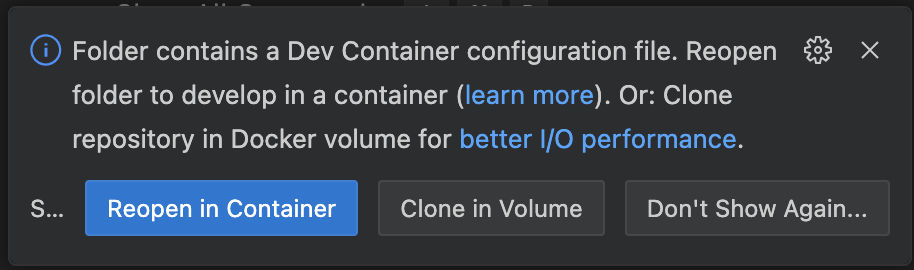
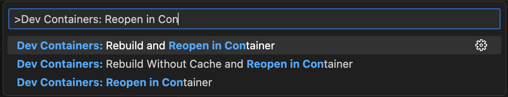
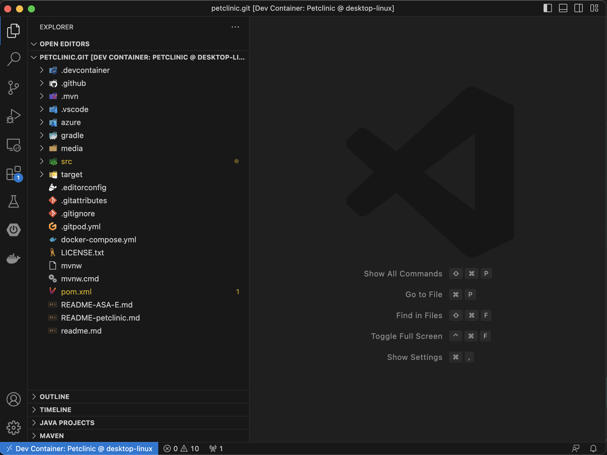

# Workshop Content

* [Deploy Spring Native Application to Azure Spring Apps Enterprise](../README.md)
  * [Unit 0 - Prerequisites and Setup](../step-00-setup-your-environment/README.md)
  * [Unit 1 - Create an Azure Spring Apps application](../step-01-create-asa-app/README.md)
  * [Unit 2 - Deploy an Azure Spring Apps application](../step-02-deploy-asa-app/README.md)
  * [Unit 3a - Bind to PostgreSQL Database](../step-03a-bind-to-postgresql-database/README.md)
  * [Unit 3b - Bind to MySQL Database](../step-03b-bind-to-mysql-database/README.md)
  * [Unit 4 - Measuring and Optimizing Usage](../step-04-measuring-and-optimizing-usage/README.md)
  * [Unit 5 - Run and Build App Locally](../step-05-run-and-build-app-locally/README.md)
    * [Configure Application with H2 Database](../step-05-run-and-build-app-locally/README.md#configure-application-with-h2-database)
    * [Run the App Locally](../step-05-run-and-build-app-locally/README.md#run-the-app-locally)
    * [Build and Package the App as a JAR](../step-05-run-and-build-app-locally/README.md#build-and-package-the-app-as-a-jar)
    * [Build and Package the App as a Java Native Image](../step-05-run-and-build-app-locally/README.md#build-and-package-the-app-as-a-java-native-image)
    * [Build and Run App Locally with Docker](../step-05-run-and-build-app-locally/README.md#build-and-run-app-locally-with-docker)
    * [Build and Run App Locally with Docker and PostgreSQL](../step-05-run-and-build-app-locally/README.md#build-and-run-app-locally-with-docker-and-postgresql)
    * [Build and Run App Locally with Docker and MySQL](../step-05-run-and-build-app-locally/README.md#build-and-run-app-locally-with-docker-and-mysql)


# Unit 5 - Run and Build App Locally

In this module we will run and build the application locally. We will look at both standard Java
and Java Native Image way to build a Java app.

## Configure Application with H2 Database

> NOTE: By default, the source code is configured to use MySQL database. Spring applications can
dynamically load the application configuration based on the runtime, class loaders, environment
variables, etc.

In this module, we will use H2 (in-memory) SQL database first, as it doesn't require any external
SQL databases, or local Docker environment.

We will use the pre-configured `src/main/resources/application.properties` file, e.g.

```
# database init, supports mysql and postgresql too
database=h2
spring.sql.init.schema-locations=classpath*:db/${database}/schema.sql
spring.sql.init.data-locations=classpath*:db/${database}/data.sql

# Web
spring.thymeleaf.mode=HTML

# JPA
spring.jpa.hibernate.ddl-auto=none
spring.jpa.open-in-view=true

# Internationalization
spring.messages.basename=messages/messages

# Actuator
management.endpoints.web.exposure.include=*

# Logging
logging.level.org.springframework=INFO
# logging.level.org.springframework.web=DEBUG
# logging.level.org.springframework.context.annotation=TRACE

# Maximum time static resources should be cached
spring.web.resources.cache.cachecontrol.max-age=12h

# SQL is written to be idempotent so this is safe
spring.sql.init.mode=always
```

Let's copy this file from the provided templates, e.g.

```shell
cp ./src/main/resources/copy-h2.application.properties ./src/main/resources/application.properties
```

## Run the App Locally

We can run the application straight from the command line using Maven, e.g.

```shell
./mvnw spring-boot:run
```

> Explore: How fast does the application start, e.g.

```
Started PetClinicApplication in 2.407 seconds (process running for 2.569)
```

## Build and Package the App as a JAR

We can build and package the application as a JAR from the command line using Maven, e.g.

```shell
./mvnw clean package -DskipTests
```

> Note: We will skip over the tests as they include various integration tests that leverage Docker.
If you have local Docker host installed, you can try package the app with executing full test suite.

You can execute the packaged JAR file from the `target` folder, e.g.

```shell
java -jar target/spring-petclinic-3.1.0-SNAPSHOT.jar
```

> Explore: How fast does the application start, e.g.

```
Started PetClinicApplication in 3.183 seconds (process running for 3.461)
```


## Build and Package the App as a Java Native Image

In order to build a native application from Java source code, you will need a compatible JVM,
such as GraalVM. Please make sure you have a compatible JVM, e.g.

```shell
java -version

openjdk version "17.0.7" 2023-04-18 LTS
OpenJDK Runtime Environment GraalVM 22.3.2 (build 17.0.7+7-LTS)
OpenJDK 64-Bit Server VM GraalVM 22.3.2 (build 17.0.7+7-LTS, mixed mode, sharing)
```

Use GraalVM to compile native application from Java source code, e.g.

```shell
./mvnw clean -DskipTests -Pnative native:compile
```

This should take few minutes to compile, depending on the resources of your local machine.

> Explore: How long did it take to build the native application on your machine, e.g.

```
[INFO] ------------------------------------------------------------------------
[INFO] BUILD SUCCESS
[INFO] ------------------------------------------------------------------------
[INFO] Total time:  02:40 min
[INFO] ------------------------------------------------------------------------
```

Run the application locally, e.g.

```shell
./target/spring-petclinic
```

> Explore: Notice how much faster the application starts using Java Native image, e.g.

```
Started PetClinicApplication in 0.279 seconds (process running for 0.306)
```

## Build and Run App Locally with Docker

Make sure you have the local Docker environment running. Now, we can leverage full test suite
as part of building our packaged JAR application, e.g.

```shell
./mvnw clean package
```

> Note: Notice that both `postgres` and `mysql` container images are being pulled from Docker Hub.

> Explore: Check which versions are being pulled from Docker Hub. Where is that configured?

## Build and Run App Locally with Docker and PostgreSQL 

As in previous section, make sure you have Docker envirionment running. 

First, we need to start the `docker-compose` for PostgreSQL container, e.g.

```shell
docker-compose up postgres
```

Now, we can start the application locally, e.g.

```shell
./mvnw clean -DskipTests -Dspring.profiles.active=postgres spring-boot:run
```

Also, we can use same packaged JAR, e.g.

```shell
./mvnw clean package
java -jar -Dspring.profiles.active=postgres target/spring-petclinic-3.1.0-SNAPSHOT.jar
```

## Build and Run App Locally with Docker and MySQL

As in previous section, make sure you have Docker envirionment running. 

First, we need to start the `docker-compose` for MySQL container, e.g.

```shell
docker-compose up mysql
```

Now, we can start the application locally, e.g.

```shell
./mvnw clean -DskipTests -Dspring.profiles.active=mysql spring-boot:run
```

Also, we can use same packaged JAR, e.g.

```shell
./mvnw clean package
java -jar -Dspring.profiles.active=mysql target/spring-petclinic-3.1.0-SNAPSHOT.jar
```

## Build and Run App Locally with Dev Containers

Another option to deploy locally is to use Visual Studio Code Dev Containers. This enables Visual Studio Code to automatically open your repository in a docker container, and you can run locally in the docker container.

There are three ways to open a repository in a in a Dev Container:

The first way is that when you open the repository in Visual Studio Code, it will ask you if you want to open the dev container via a notification:



Click `Reopen in Container`.

Thes second way is to use the command palette (CMD-SHIFT-P) and select `Dev Containers: Reopen in Container`:



When you have successfully opened the repository inside a dev container, you should see the following UI hints in Visual Studio Code:



(Notice the "Dev Container" in the title and "Dev Container" on the bottom left status bar).

Once you open the repository in the dev container, run Maven:

```
mvn -Pnative spring-boot:build-image -Dmaven.test.skip
```
